# 암호화폐 페어 트레이딩 전략 개선 방안

## 🚀 수익률 개선을 위한 종합 전략

```mermaid
flowchart TD
    A["📊 현재 전략 한계점"] --> B["📈 수익률 개선 방안"]
    
    A --> A1["🔹 고정 헤지비율<br/>공적분 계수만 사용"]
    A --> A2["🔹 단순한 진입/청산<br/>임계값 기반만"]
    A --> A3["🔹 거래비용 미반영<br/>슬리피지 무시"]
    A --> A4["🔹 고정 포지션 사이즈<br/>리스크 최적화 부족"]
    A --> A5["🔹 시장 상황 무시<br/>변동성 적응 부족"]
    
    B --> C1["🎯 동적 헤지비율 최적화"]
    B --> C3["⚖️ 리스크 관리 고도화"]
    B --> C4["💰 거래비용 최적화"]
    B --> C5["📊 포트폴리오 다각화"]
    
    %% 동적 헤지비율 최적화
    C1 --> D1["📈 롤링 윈도우 헤지비율<br/>30일/60일/90일 비교"]
    C1 --> D2["🔄 GARCH 기반 동적 조정<br/>변동성 반영"]
    C1 --> D3["📊 Kalman Filter 적용<br/>실시간 계수 업데이트"]
    
    %% 리스크 관리 고도화
    C3 --> F1["📉 VaR 기반 포지션 사이징<br/>95%/99% 신뢰구간"]
    C3 --> F2["🛡️ 동적 스톱로스<br/>ATR 기반 조정"]
    C3 --> F3["⏰ 시간 기반 청산<br/>홀딩 기간 제한"]
    C3 --> F4["📊 최대 드로우다운 제한<br/>5%/10% 제한선"]
    
    %% 거래비용 최적화
    C4 --> G1["⚖️ 거래량 기반 수수료<br/>VIP 등급 활용"]
    C4 --> G3["⏱️ 거래 타이밍 최적화<br/>유동성 높은 시간대"]
    C4 --> G4["🔄 리밸런싱 빈도 조정<br/>비용 vs 성과 밸런스"]
    
    %% 포트폴리오 다각화
    C5 --> H1["🎲 다중 페어 전략<br/>6개 → 15개 페어"]
    C5 --> H3["⏰ 다중 시간프레임<br/>1시간/4시간/1일"]
    
    %% 성과 측정
    B --> I["📊 성과 측정 지표"]
    I --> I1["📈 샤프 비율 개선<br/>목표: >1.5"]
    I --> I2["📉 최대 드로우다운<br/>목표: <15%"]
    I --> I4["💰 연간 수익률<br/>목표: >30%"]
    
    %% 실행 단계
    B --> J["🚀 구현 로드맵"]
    J --> J1["1단계: 동적 헤지비율<br/>4주 내 구현"]
    J --> J2["2단계: ML 신호 통합<br/>8주 내 구현"]
    J --> J3["3단계: 리스크 관리<br/>12주 내 구현"]
    J --> J4["4단계: 전략 다각화<br/>16주 내 구현"]
    
    %% 스타일링
    style A fill:#ffebee
    style B fill:#e8f5e8
    style C1 fill:#e3f2fd
    style C2 fill:#f3e5f5
    style C3 fill:#fff3e0
    style C4 fill:#e0f2f1
    style C5 fill:#fce4ec
    style I fill:#e8eaf6
    style J fill:#f1f8e9
```



## 📋 상세 개선 전략

### 1. 🎯 동적 헤지비율 최적화

#### 현재 문제점:
- 고정된 공적분 계수 사용
- 시장 변동성 변화 미반영
- 장기간 동일한 비율 유지

#### 개선 방안:
```python
# 롤링 윈도우 헤지비율
def dynamic_hedge_ratio(prices1, prices2, window=30):
    rolling_beta = []
    for i in range(window, len(prices1)):
        p1_window = prices1[i-window:i]
        p2_window = prices2[i-window:i]
        beta = calculate_ols_beta(p1_window, p2_window)
        rolling_beta.append(beta)
    return rolling_beta

# GARCH 기반 동적 조정
def garch_adjusted_ratio(returns1, returns2):
    # 조건부 분산 모델링
    # 변동성 클러스터링 반영
    pass
```

### 2. ⚖️ 리스크 관리 고도화

#### 현재 문제점:
- 고정 포지션 사이즈
- 드로우다운 제한 없음
- 시간 기반 청산 부재

#### 개선 방안:
```python
# VaR 기반 포지션 사이징
def kelly_criterion_sizing(win_rate, avg_win, avg_loss):
    kelly_fraction = win_rate - (1 - win_rate) * (avg_loss / avg_win)
    return min(kelly_fraction, 0.25)  # 최대 25% 제한

# 동적 스톱로스
def atr_stop_loss(prices, multiplier=2.0, period=14):
    atr = calculate_atr(prices, period)
    return prices[-1] - (atr * multiplier)
```

### 3. 💰 거래비용 최적화

#### 현재 문제점:
- 거래비용 미고려
- 슬리피지 무시
- 빈번한 리밸런싱

#### 개선 방안:
```python
# 거래비용 포함 수익률
def net_return_after_costs(gross_return, trading_volume, 
                          fee_rate=0.001, slippage=0.0005):
    trading_cost = trading_volume * (fee_rate + slippage)
    return gross_return - trading_cost

# TWAP 실행 알고리즘
def twap_execution(target_quantity, duration_minutes=30):
    slice_size = target_quantity / duration_minutes
    # 시간 분산 실행으로 슬리피지 최소화
```

### 4. 📊 포트폴리오 다각화

#### 현재 문제점:
- 제한된 페어 수 (6개)
- 단일 시간프레임
- 단순한 전략

#### 개선 방안:
```python
# 다중 페어 포트폴리오
pairs_universe = [
    'BTC-ETH', 'BTC-LTC', 'BTC-NEO',
    'ETH-LTC', 'ETH-NEO', 'LTC-NEO',
    'BTC-ADA', 'ETH-DOT', 'BNB-SOL',
    'MATIC-AVAX', 'LINK-UNI', 'ATOM-NEAR'
]

# 다중 시간프레임
timeframes = ['1h', '4h', '1d']
for tf in timeframes:
    signals[tf] = generate_signals(data, timeframe=tf)

# 신호 집계
final_signal = weighted_average(signals)
```


## 🚀 구현 우선순위

1. **1단계**: 동적 헤지비율 구현
3. **2단계**: 리스크 관리 모듈 개발
4. **3단계**: 포트폴리오 다각화 완성

각 단계별로 백테스트를 통한 성과 검증 후 다음 단계 진행
